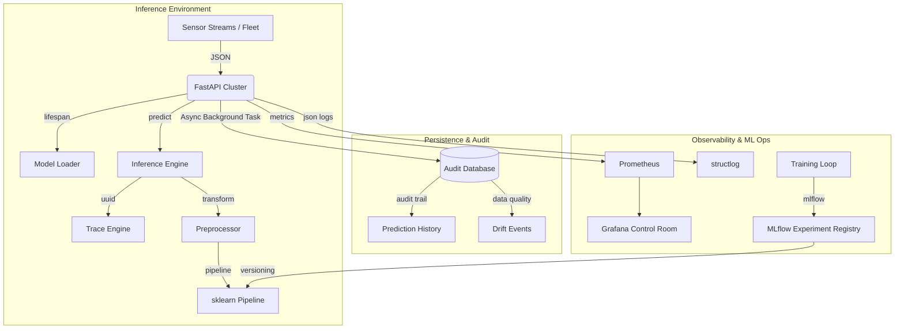

# Sentinel v10.0: Enterprise Architecture & Design

This guide provides a deep-dive into the "10/10" engineering patterns used in Sentinel v10.0 to ensure production-grade reliability and industrial compliance.

## System Design (The Ecosystem)

Sentinel is not just an API; it is a full **Observability & Audit Ecosystem**.

## Core Architectural Pillars

### 1. Asynchronous Data Persistence (The Audit Trail)
**Logic**: To avoid impacting the low-latency requirements of the prediction endpoint, we use **FastAPI's BackgroundTasks** to write to the database. Every request, including the raw JSON input, client IP, and User-Agent, is recorded in SQLite via **SQLAlchemy + aiosqlite**.
**Benefit**: Enables **Explainable AI (XAI)** post-mortems and periodic drift re-evaluation. If a machine fails, we can pull the exact history of that serial number to see why the model predicted a "LOW" risk.

### 2. Full-Lifecycle Experiment Tracking
**Logic**: Every training run is automatically instrumented with **MLflow**.
**Benefit**: 100% reproducibility. We can compare the performance deltas (F1, AUC) of different versions of the model and link a specific `model.pkl` file back to the exact code commit and hyper-parameters used to create it.

### 3. Drift Detection & Statistical Monitoring
**Logic**: The `/drift` endpoint implements **Z-score distribution analysis**.
**Benefit**: Early warning for sensor calibration issues. If the "Pro-Process Temperature" sensor starts to drift by more than 3 standard deviations, the system flags it *before* the model's accuracy degrades.

### 4. Constant-Time Security & Compliance
**Logic**: Sentinel implements **Constant-Time API Key comparisons** using `secrets.compare_digest`.
**Benefit**: Protection against timing attacks, where an attacker measures the sub-millisecond response time of the server to guess characters in the API key.

## Data Governance

- **Zero-Friction Bootstrap**: `make bootstrap` generates high-fidelity synthetic data on-demand, allowing for instant CI/CD validation.
- **Controlled Exposure**: Proprietary datasets and model binaries are strictly excluded from Git, fetched only from secure object storage (S3/GH Releases) during deployment.
- **Audit Compliance**: v10.0 stores all inference metadata for auditing and compliance (ISO-9001 style traceability).
