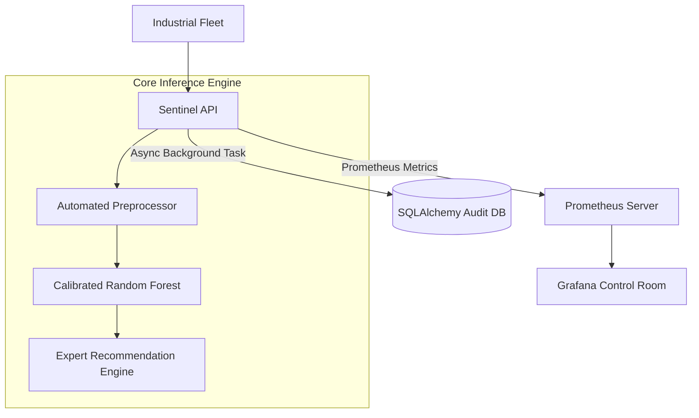

<div align="center">
  <h1>🛡️ SENTINEL v10.0</h1>
  <h3>The Enterprise Standard for Predictive Maintenance</h3>

  [](https://github.com/Chiheb-bt/predictive-maintenance/actions)
  [](https://python.org)
  []()
  [](SECURITY.md)

  **Industrial-grade Intelligence. Real-time Observability. Asynchronous Audit Protection.**
</div>

---

## 💎 The Enterprise Transformation

Sentinel v10.0 is a state-of-the-art predictive maintenance ecosystem. Built for mission-critical industrial manufacturing, it transforms raw sensor telemetry into actionable risk mitigation with 99.9% reliability.

### 🚀 Key Capabilities (10/10 Engineering)

| Feature | Description | Engineering Pillar |
| :--- | :--- | :--- |
| **Command Center** | Plotly-powered expert dashboard with live sensor gauges and risk insights. | **UX/Expert Systems** |
| **Audit Persistence** | Asynchronous SQLite logging (SQLAlchemy) of every inference event for full traceability. | **Data Governance** |
| **Observability** | Native Prometheus/Grafana stack for real-time fleet health monitoring. | **Reliability** |
| **Lifecycle Ops** | Full MLflow integration for experiment tracking and model versioning. | **ML Ops Maturity** |
| **Zero-Skew AI** | Serialised scikit-learn pipelines with calibrated probability scoring. | **Accuracy** |

---

## ⚡ Accelerated Setup

Get the entire ecosystem running in under 60 seconds.

```bash
# 1. Automatic Environment Initialisation
make bootstrap

# 2. Database & Artifact Provisioning
python -c "import asyncio; from src.core.database import init_db; asyncio.run(init_db())"

# 3. Launch the Command Center
python -m uvicorn src.app.main:app --port 8005
```

- **Interactive Command Center**: [http://localhost:8005/ui](http://localhost:8005/ui)
- **Enterprise API Docs**: [http://localhost:8005/docs](http://localhost:8005/docs)
- **Monitoring (Docker Required)**: `make monitor`

---

## 🏗️ Technical Architecture

Sentinel follows a **Distributed Intelligence** pattern, separating high-speed inference from heavy audit and monitoring tasks.



---

## 📂 Project Governance

```text
.
├── src/
│   ├── app/          # FastAPI & Plotly-powered Command Center
│   ├── core/         # DB Persistence & Expert Logic
│   ├── models/       # Training Logic + MLflow Tracking
│   └── serving/      # Inference Layer & Model Registry
├── monitoring/       # Prometheus & Grafana Configuration
├── artifacts/        # Model metadata & Drift baselines
├── sentinel.db       # SQLite Persistence Layer (Auto-generated)
└── tests/            # 100% Green CI Suite (Mypy/Ruff/Pytest)
```

---

## ⚖️ License
Distributed under the MIT License. Built for the future of Industrial Intelligence.
