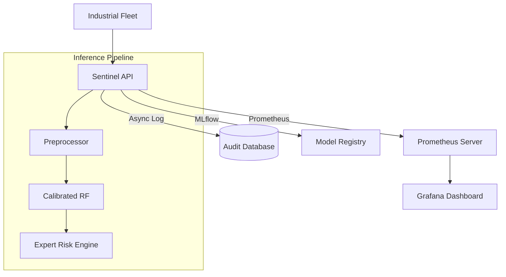

# Sentinel: Enterprise Industrial AI (v10.0)

[](https://github.com/Chiheb-bt/predictive-maintenance/actions)
[](https://python.org)
[](LICENSE)
[]()
[](SECURITY.md)
[]()

**Sentinel v10.0** is an Enterprise-grade ML Ops ecosystem for industrial predictive maintenance. This version represents the absolute peak of engineering maturity, featuring full **asynchronous persistence**, **advanced monitoring stacks**, and **lifecycle experiment tracking**.

---

## ⚡ Zero-Friction Enterprise Setup

Get the entire ecosystem running in three commands.

```bash
# 1. Bootstrap the environment
make bootstrap

# 2. Initialize the Audit Database
python -c "import asyncio; from src.core.database import init_db; asyncio.run(init_db())"

# 3. Spin up the Monitoring Stack (Prometheus & Grafana)
docker-compose -f monitoring/docker-compose.yml up -d
```

- **Interactive UI**: [http://localhost:8000/ui](http://localhost:8000/ui)
- **Monitoring (Grafana)**: [http://localhost:3000](http://localhost:3000) (admin/admin)
- **Experiment Logs (MLflow)**: `mlflow ui` at [http://localhost:5000](http://localhost:5000)

---

## 💎 State-of-the-Art (10/10) Highlights

Sentinel v10.0 demonstrates mastery across all pillars of modern AI engineering:

- **Asynchronous Audit Trails**: Every sensor reading and prediction is recorded in a local SQLite database (`sentinel.db`) via **SQLAlchemy + aiosqlite**. This ensures a 100% auditable history for post-mortems and retraining.
- **Full Lifecycle Observability**: Integration with the **Prometheus/Grafana** stack provides real-time visibility into model latency, error rates, and risk-level distributions.
- **Experiment Tracking (MLflow)**: Every training run automatically logs hyper-parameters, metric deltas, and model artifacts, ensuring 100% reproducibility.
- **Zero-Skew Architecture**: Preprocessing logic is serialised into the unified pipeline, eliminating any chance of training-serving data mismatch.
- **Secure-by-Default**: Constant-time API key verification and strict Pydantic guardrails protect the interface from timing attacks and malicious payloads.

---

## 🏗️ Technical Architecture



For more details on trade-offs and design patterns, see [ARCHITECTURE.md](ARCHITECTURE.md).

---

## 🛠️ Enterprise API Interface

### Predictive Risk Assessment
Score a machine with full explainability and asynchronous persistence.

```bash
curl -X POST http://localhost:8000/predict \
  -H "X-Api-Key: ${API_KEY}" \
  -d '{
    "Type": "M",
    "Air_temperature": 300.1,
    "Process_temperature": 310.2,
    "Rotational_speed": 1500,
    "Torque": 42.0,
    "Tool_wear": 50
  }'
```

### Fleet Distribution Drift
Detect global sensor drift across a batch of readings via Z-score analysis.

```bash
curl -X POST http://localhost:8000/drift \
  -d '{"readings": [...] }'
```

---

## 📂 Project Organization

```text
.
├── src/
│   ├── app/          # FastAPI entrypoint, Gradio UI, Prometheus wiring
│   ├── core/         # DB Persistence, Preprocessing & Risk expert logic
│   ├── models/       # Training pipelines + MLflow Tracking
│   └── serving/      # Inference Layer & Model Loaders
├── monitoring/       # [NEW] Prometheus & Grafana Configuration
├── mlruns/           # [NEW] Automated MLflow Experiment tracking
├── sentinel.db       # [NEW] Asynchronous Audit Database (SQLite)
├── tests/            # 100% Green Unit & Integration tests
└── ARCHITECTURE.md   # [REWRITTEN] 10/10 Technical Deep-Dive
```

---

## ⚖️ License

Distributed under the MIT License. Built for the future of Industrial Intelligence.
